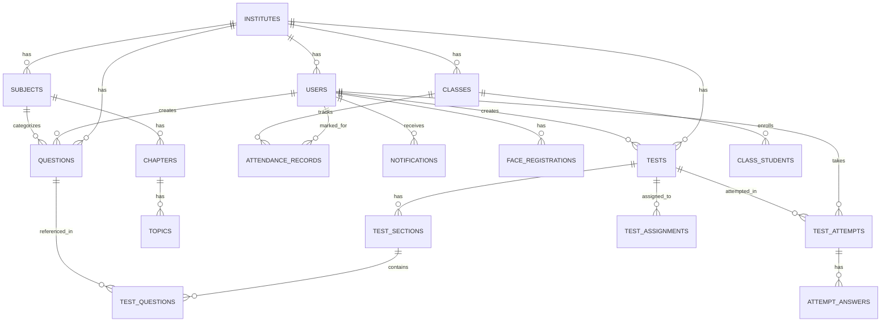

# 📊 Database Schema — Coaching Pro

> **Database:** Supabase (PostgreSQL)
> **Last Updated:** 1 March 2026

---

## Entity Relationship Diagram

---

## Tables

### 1. `institutes`

Represents a coaching institute (multi-tenant isolation).

| Column | Type | Constraints | Description |
|--------|------|-------------|-------------|
| `id` | `uuid` | PK, default `gen_random_uuid()` | Unique institute ID |
| `name` | `text` | NOT NULL | Institute display name |
| `slug` | `text` | UNIQUE | URL-friendly identifier |
| `logo_url` | `text` | - | Logo image URL |
| `settings` | `jsonb` | default `{}` | Custom institute config |
| `created_at` | `timestamptz` | default `now()` | Creation timestamp |

---

### 2. `users`

All users (admins, teachers, students, parents). Linked to Supabase Auth.

| Column | Type | Constraints | Description |
|--------|------|-------------|-------------|
| `id` | `uuid` | PK | Matches Supabase `auth.users.id` |
| `email` | `text` | UNIQUE, NOT NULL | Login email |
| `name` | `text` | NOT NULL | Full name |
| `role` | `text` | NOT NULL | `ADMIN`, `TEACHER`, `STUDENT`, `PARENT` |
| `phone` | `text` | - | Phone number |
| `avatar_url` | `text` | - | Profile picture URL |
| `institute_id` | `uuid` | FK → `institutes.id` | Tenant isolation |
| `profile` | `jsonb` | default `{}` | Role-specific data (class, batch, subjects, etc.) |
| `is_active` | `boolean` | default `true` | Account status |
| `created_at` | `timestamptz` | default `now()` | Registration timestamp |
| `updated_at` | `timestamptz` | - | Last profile update |

**Profile JSONB structure varies by role:**
- **Student:** `{ class, batch, parentPhone, rollNumber }`
- **Teacher:** `{ subjects: [], classes: [], qualification }`
- **Parent:** `{ studentIds: [] }`

---

### 3. `subjects`

Academic subjects within an institute.

| Column | Type | Constraints | Description |
|--------|------|-------------|-------------|
| `id` | `uuid` | PK | Subject ID |
| `name` | `text` | NOT NULL | e.g., "Physics", "Mathematics" |
| `code` | `text` | - | Short code, e.g., "PHY" |
| `institute_id` | `uuid` | FK → `institutes.id` | Tenant isolation |
| `created_at` | `timestamptz` | default `now()` | - |

---

### 4. `chapters`

Chapters within a subject.

| Column | Type | Constraints | Description |
|--------|------|-------------|-------------|
| `id` | `uuid` | PK | Chapter ID |
| `name` | `text` | NOT NULL | e.g., "Circular Motion" |
| `subject_id` | `uuid` | FK → `subjects.id` | Parent subject |
| `order` | `integer` | default `0` | Display order |
| `created_at` | `timestamptz` | default `now()` | - |

---

### 5. `topics`

Topics within a chapter.

| Column | Type | Constraints | Description |
|--------|------|-------------|-------------|
| `id` | `uuid` | PK | Topic ID |
| `name` | `text` | NOT NULL | e.g., "Angular Velocity" |
| `chapter_id` | `uuid` | FK → `chapters.id` | Parent chapter |
| `created_at` | `timestamptz` | default `now()` | - |

---

### 6. `questions`

The Question Bank — all questions managed by the institute.

| Column | Type | Constraints | Description |
|--------|------|-------------|-------------|
| `id` | `uuid` | PK | Question ID |
| `question_text` | `text` | NOT NULL | The question (supports LaTeX/Markdown) |
| `question_type` | `text` | NOT NULL | `MCQ`, `NUMERICAL`, `SUBJECTIVE`, `MULTI_CORRECT` |
| `options` | `jsonb` | - | `{ "A": "...", "B": "...", "C": "...", "D": "..." }` |
| `correct_answer` | `text` | - | e.g., "C" for MCQ, "42" for numerical |
| `explanation` | `text` | - | Solution explanation |
| `difficulty` | `text` | default `'MEDIUM'` | `EASY`, `MEDIUM`, `HARD` |
| `marks` | `integer` | default `1` | Positive marks |
| `negative_marks` | `integer` | default `0` | Negative marks for wrong answer |
| `time_estimate` | `integer` | - | Expected time in seconds |
| `image_url` | `text` | - | Attached image URL |
| `tags` | `text[]` | - | Array of tag strings |
| `subject_id` | `uuid` | FK → `subjects.id` | Subject classification |
| `chapter_id` | `uuid` | FK → `chapters.id` | Chapter classification |
| `topic_id` | `uuid` | FK → `topics.id` | Topic classification |
| `institute_id` | `uuid` | FK → `institutes.id` | Tenant isolation |
| `created_by` | `uuid` | FK → `users.id` | Author (teacher/admin) |
| `is_deleted` | `boolean` | default `false` | Soft delete flag |
| `created_at` | `timestamptz` | default `now()` | - |
| `updated_at` | `timestamptz` | - | Last edit timestamp |

---

### 7. `tests`

Test/exam definitions.

| Column | Type | Constraints | Description |
|--------|------|-------------|-------------|
| `id` | `uuid` | PK | Test ID |
| `title` | `text` | NOT NULL | Test name |
| `description` | `text` | - | Test description |
| `test_type` | `text` | default `'PRACTICE'` | `MOCK_EXAM`, `CHAPTER_TEST`, `PRACTICE`, `ASSIGNMENT` |
| `duration` | `integer` | - | Duration in minutes |
| `total_marks` | `integer` | - | Total marks |
| `passing_marks` | `integer` | - | Minimum passing marks |
| `is_published` | `boolean` | default `false` | Published status |
| `settings` | `jsonb` | default `{}` | `{ shuffle, showResults, allowReview }` |
| `institute_id` | `uuid` | FK → `institutes.id` | Tenant isolation |
| `created_by` | `uuid` | FK → `users.id` | Author |
| `created_at` | `timestamptz` | default `now()` | - |
| `updated_at` | `timestamptz` | - | - |

---

### 8. `test_sections`

Sections within a test (e.g., "Physics", "Chemistry").

| Column | Type | Constraints | Description |
|--------|------|-------------|-------------|
| `id` | `uuid` | PK | Section ID |
| `test_id` | `uuid` | FK → `tests.id` | Parent test |
| `name` | `text` | NOT NULL | Section name |
| `order` | `integer` | default `0` | Display order |
| `created_at` | `timestamptz` | default `now()` | - |

---

### 9. `test_questions`

Questions assigned to a test section (junction table).

| Column | Type | Constraints | Description |
|--------|------|-------------|-------------|
| `id` | `uuid` | PK | Junction ID |
| `test_id` | `uuid` | FK → `tests.id` | Parent test |
| `section_id` | `uuid` | FK → `test_sections.id` | Section within the test |
| `question_id` | `uuid` | FK → `questions.id` | The question |
| `marks` | `integer` | NOT NULL | Marks for this question in this test |
| `negative_marks` | `integer` | default `0` | Negative marks |
| `order` | `integer` | default `0` | Display order |

---

### 10. `test_assignments`

Maps tests to assigned students.

| Column | Type | Constraints | Description |
|--------|------|-------------|-------------|
| `id` | `uuid` | PK | Assignment ID |
| `test_id` | `uuid` | FK → `tests.id` | Test |
| `student_id` | `uuid` | FK → `users.id` | Student |
| `assigned_at` | `timestamptz` | default `now()` | - |

---

### 11. `test_attempts`

Records of students taking tests.

| Column | Type | Constraints | Description |
|--------|------|-------------|-------------|
| `id` | `uuid` | PK | Attempt ID |
| `test_id` | `uuid` | FK → `tests.id` | Test taken |
| `student_id` | `uuid` | FK → `users.id` | Student |
| `status` | `text` | default `'IN_PROGRESS'` | `IN_PROGRESS`, `SUBMITTED` |
| `started_at` | `timestamptz` | default `now()` | Start time |
| `submitted_at` | `timestamptz` | - | Submission time |
| `score` | `numeric` | - | Total score obtained |
| `percentage` | `numeric` | - | Score percentage |
| `rank` | `integer` | - | Rank among all attempts |
| `correct_count` | `integer` | default `0` | Correct answers |
| `incorrect_count` | `integer` | default `0` | Incorrect answers |
| `unattempted_count` | `integer` | default `0` | Skipped questions |
| `tab_switches` | `integer` | default `0` | Anti-cheat: tab switch count |

---

### 12. `attempt_answers`

Individual answers within an attempt.

| Column | Type | Constraints | Description |
|--------|------|-------------|-------------|
| `id` | `uuid` | PK | Answer ID |
| `attempt_id` | `uuid` | FK → `test_attempts.id` | Parent attempt |
| `question_id` | `uuid` | FK → `questions.id` | Question answered |
| `answer` | `text` | - | Student's answer |
| `is_correct` | `boolean` | - | Grading result |
| `marks_obtained` | `numeric` | - | Marks for this answer |
| `time_taken` | `integer` | - | Time spent (seconds) |
| `marked_for_review` | `boolean` | default `false` | Review flag |

---

### 13. `classes`

Classes/batches for attendance tracking.

| Column | Type | Constraints | Description |
|--------|------|-------------|-------------|
| `id` | `uuid` | PK | Class ID |
| `name` | `text` | NOT NULL | e.g., "Batch A - JEE 2026" |
| `institute_id` | `uuid` | FK → `institutes.id` | Tenant isolation |
| `created_at` | `timestamptz` | default `now()` | - |

---

### 14. `class_students`

Enrollment — maps students to classes.

| Column | Type | Constraints | Description |
|--------|------|-------------|-------------|
| `id` | `uuid` | PK | Enrollment ID |
| `class_id` | `uuid` | FK → `classes.id` | Class |
| `student_id` | `uuid` | FK → `users.id` | Student |

---

### 15. `attendance_records`

Daily attendance entries.

| Column | Type | Constraints | Description |
|--------|------|-------------|-------------|
| `id` | `uuid` | PK | Record ID |
| `student_id` | `uuid` | FK → `users.id` | Student |
| `class_id` | `uuid` | FK → `classes.id` | Class |
| `date` | `date` | NOT NULL | Attendance date |
| `status` | `text` | NOT NULL | `PRESENT`, `ABSENT`, `LATE` |
| `marked_by` | `uuid` | FK → `users.id` | Teacher/Admin who marked |
| `method` | `text` | default `'MANUAL'` | `MANUAL`, `FACE_RECOGNITION` |
| `confidence` | `numeric` | - | Face recognition confidence % |
| `created_at` | `timestamptz` | default `now()` | - |

---

### 16. `face_registrations`

Face data for biometric attendance.

| Column | Type | Constraints | Description |
|--------|------|-------------|-------------|
| `id` | `uuid` | PK | Registration ID |
| `student_id` | `uuid` | FK → `users.id` | Student |
| `face_images` | `text[]` | - | Array of base64/URLs of face images |
| `is_registered` | `boolean` | default `false` | Registration complete |
| `created_at` | `timestamptz` | default `now()` | - |

---

### 17. `notifications`

In-app notification system.

| Column | Type | Constraints | Description |
|--------|------|-------------|-------------|
| `id` | `uuid` | PK | Notification ID |
| `user_id` | `uuid` | FK → `users.id` | Recipient |
| `type` | `text` | NOT NULL | e.g., `TEST_PUBLISHED`, `RESULT_READY` |
| `title` | `text` | NOT NULL | Notification title |
| `message` | `text` | NOT NULL | Notification body |
| `data` | `jsonb` | default `{}` | Extra payload (test ID, etc.) |
| `is_read` | `boolean` | default `false` | Read status |
| `read_at` | `timestamptz` | - | When read |
| `sent_at` | `timestamptz` | default `now()` | When sent |

---

## Row Level Security (RLS)

All tables have RLS enabled with the following general policies:

| Policy | Description |
|--------|-------------|
| Institute Isolation | Users can only access data within their `institute_id` |
| Role-Based Access | `ADMIN`/`TEACHER` can write; `STUDENT` has read-only access to their own data |
| Soft Delete | Questions use `is_deleted = false` filter by default |

---

## Indexes

| Table | Column(s) | Type | Purpose |
|-------|-----------|------|---------|
| `users` | `email` | UNIQUE | Login lookup |
| `users` | `institute_id, role` | B-tree | Dashboard counts |
| `questions` | `institute_id, is_deleted` | B-tree | Question listing |
| `questions` | `question_text` | GIN (trigram) | Full-text search |
| `tests` | `institute_id, created_at` | B-tree | Test listing |
| `test_attempts` | `test_id, student_id` | B-tree | Result lookup |
| `attendance_records` | `class_id, date` | B-tree | Daily attendance query |
| `notifications` | `user_id, is_read` | B-tree | Unread notifications |
